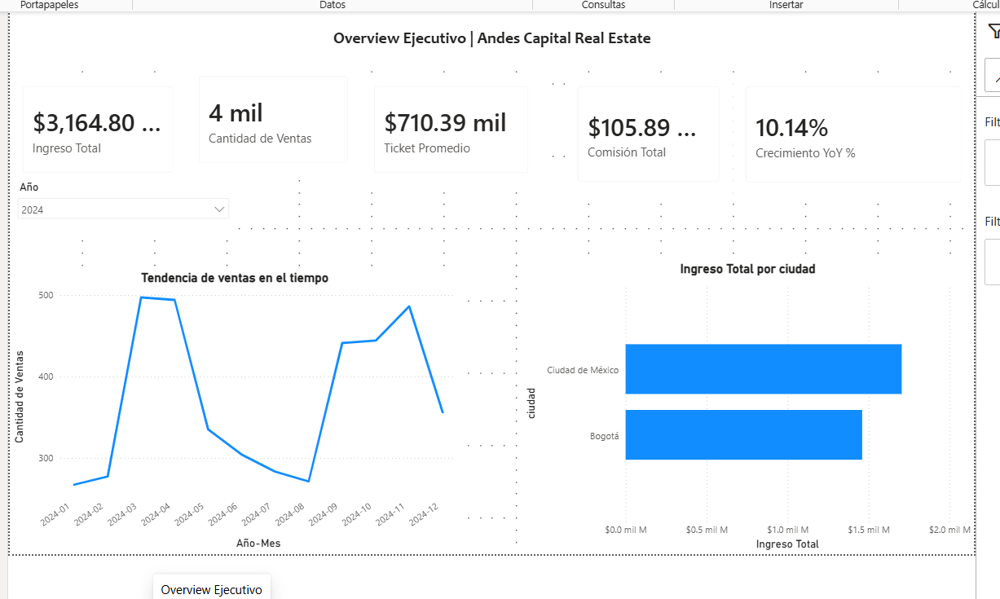
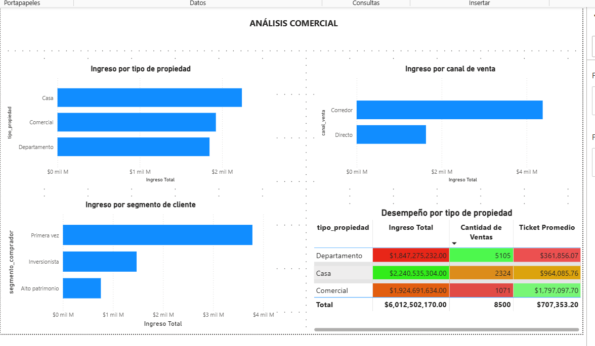
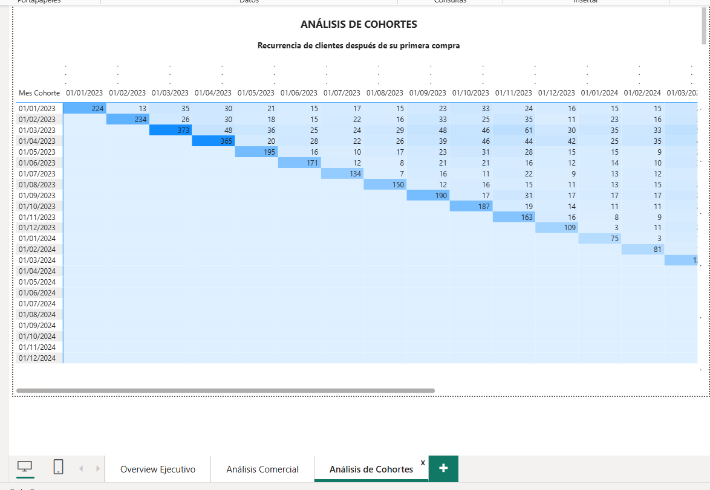

# 🏠 Dashboard de Análisis Comercial | Andes Capital Real Estate

## 📌 Descripción

Proyecto de análisis de datos desarrollado en **Power BI** para evaluar el desempeño comercial de una empresa del sector inmobiliario.

El dashboard transforma los datos de ventas en información visual que permite analizar ingresos, tipos de propiedad, segmentos de clientes, canales de venta y recurrencia de compradores.

---

## 🎯 Objetivo

El objetivo fue responder preguntas de negocio como:

- ¿Cuánto ingreso genera la empresa?
- ¿Qué tipos de propiedad generan mayores ingresos?
- ¿Qué segmentos de clientes aportan más al negocio?
- ¿Qué canales de venta tienen mejor desempeño?
- ¿Cómo evolucionan las ventas a lo largo del tiempo?
- ¿Qué comportamiento tienen los clientes después de su primera compra?

---

## 🛠️ Herramientas utilizadas

- Power BI
- DAX
- Modelado de datos
- Visualización de datos
- Análisis de cohortes

---

## 🔎 Proceso

1. Preparé los datos y construí el modelo necesario para realizar el análisis.
2. Creé medidas e indicadores con **DAX** para responder las principales preguntas del negocio.
3. Construí KPIs para analizar ingresos, cantidad de ventas, ticket promedio, comisiones y crecimiento interanual.
4. Analicé los resultados por tipo de propiedad, segmento de cliente y canal de venta.
5. Construí un análisis de cohortes para estudiar la recurrencia de los clientes después de su primera compra.
6. Organicé los resultados en un dashboard interactivo dividido en tres secciones: Overview Ejecutivo, Análisis Comercial y Análisis de Cohortes.

---

## 📊 Dashboard

### Overview Ejecutivo

Permite consultar los principales KPIs y observar la evolución de las ventas y los ingresos por ciudad.

### Análisis Comercial

Permite comparar los ingresos por tipo de propiedad, segmento de cliente y canal de venta.

### Análisis de Cohortes

Permite analizar la recurrencia de los clientes después de su primera compra.

---

## 💡 Insights principales

### 1. Las casas destacan por su aporte a los ingresos

Las casas generaron aproximadamente **$2.24 mil millones en ingresos**, con **2,324 ventas** y un ticket promedio cercano a **$964 mil**.

Los departamentos registraron una mayor cantidad de operaciones (**5,105 ventas**), pero un ticket promedio menor, de aproximadamente **$362 mil**. Esto muestra que un mayor volumen de ventas no necesariamente representa un mayor valor por operación.

### 2. Los compradores de primera vez son un segmento clave

El segmento **“Primera vez”** presenta el mayor ingreso entre los segmentos analizados, superando a inversionistas y compradores de alto patrimonio.

Esto sugiere que los nuevos compradores representan un grupo especialmente importante para el desempeño comercial.

### 3. Existe una oportunidad para mejorar la recurrencia

El análisis de cohortes muestra que la cantidad de clientes que realizan compras posteriores disminuye considerablemente después de la primera operación.

Esto representa una oportunidad para desarrollar estrategias de seguimiento y fidelización.

---

## 🚀 Recomendaciones

- Mantener una estrategia comercial diferenciada por tipo de propiedad, considerando tanto el volumen como el valor promedio de las operaciones.
- Fortalecer las acciones dirigidas a compradores de primera vez.
- Analizar las características de los clientes que vuelven a comprar para identificar oportunidades de fidelización.
- Evaluar qué canales de venta están relacionados con mejores resultados y mayor recurrencia.

---

## 📂 Entregable

El repositorio incluye el archivo original de **Power BI (.pbix)** para consultar el dashboard completo.

---

## 👩‍💻 Sobre mí

Soy estudiante de **Análisis de Datos** y me interesa transformar datos en información clara que ayude a entender problemas y tomar mejores decisiones.

Actualmente continúo desarrollando mis habilidades en **SQL, Python, Excel y Power BI** y construyendo proyectos orientados a problemas de negocio.

